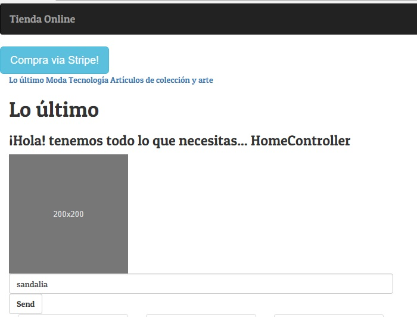
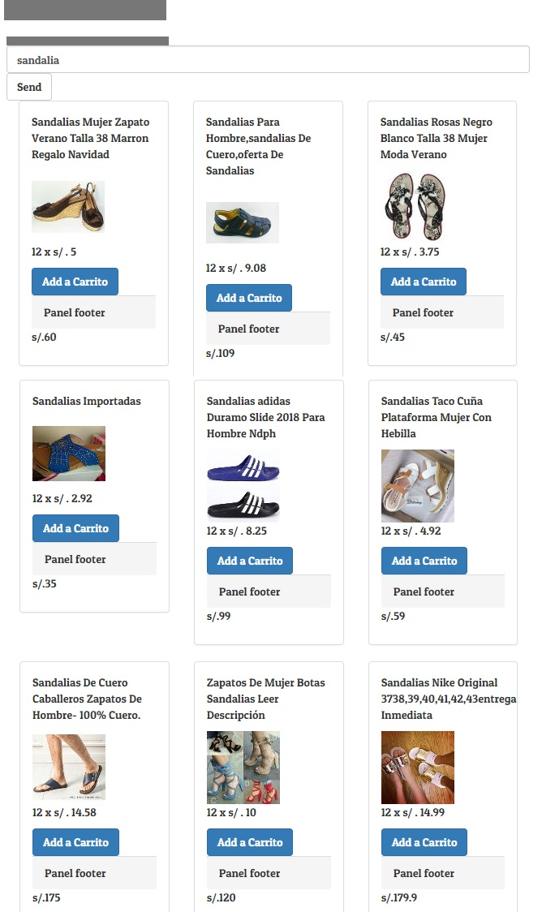

# SINGLE PAGE APP (SPA) MULTI-USUARIO CONSUMIENDO DATA REMOTA_

**SPA multiusuario consumiendo data remota** s una aplicación web que cabe en una sola página. Todo su código (JS, HTML, CSS) se recupera con una sola carga de página. Y la navegación entre las páginas se realiza sin actualizar toda la página.

***
## Plan de trabajo

#### 1. Se realiza un `Fork` al repositorio original

```
https://github.com/Laboratoria-learning/ecommerse-product-final
```

#### 2.Planificación

Se planifico las actividades a desarrollar para es estudio y aplicación de las apis y nuevas tecnologías en dicho proyecto

#### 3. Recursos

##### 3.1. Angular
es un potente marco de JavaScript para crear aplicaciones web dinámicas. 

##### 3.2. Visual Studio Code
Editor de código fuente.

##### 3.3. Jquery
Librería de JavaScript de código abierto que permite agregar interactividad y efectos visuales.

##### 3.4. Bootstrap
 Framework que permite facilitar el desarrollo.

##### 3.5. Google Fonts
Directorio interactivo que permite añadir tipografias a la web.


***
## Producto 


***

***

***

***

***

***


## Colaboradores

* Melissa Yauri
* Silvia Fuentes
* Eleyne Ramírez