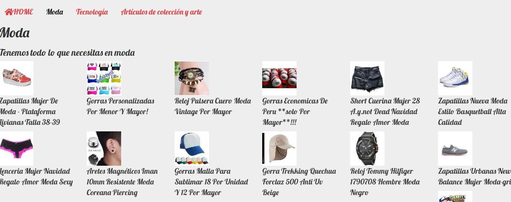

# SINGLE PAGE APP (SPA) MULTI-USUARIO CONSUMIENDO DATA REMOTA_

**SPA multiusuario consumiendo data remota** s una aplicación web que cabe en una sola página. Todo su código (JS, HTML, CSS) se recupera con una sola carga de página. Y la navegación entre las páginas se realiza sin actualizar toda la página.

***
## Objetivo
Crear una app web bajo los principios de SPA para tener una plataforma de articulos y que se realice una compra.

[Guia](https://fab.com/)

## Consideraciones en el poyecto
* Templating
* Routing (URLs)
* DOM & Event Handling (State)
* Patrón de arquitectura de software (MV*)

## Colaboradores

* Melissa Yauri
* Silvia Fuentes
* Eleyne Ramírez

## 3. Recursos

##### 3.1. Angular
Es un potente marco de JavaScript para crear aplicaciones web dinámicas.Y el que permitio el routing.

##### 3.2. Librería Handlebars
Basado en  lenguaje de plantillas Mustache, es un motor de plantillas.El cual permitió implementar los templates.

##### 3.3. Visual Studio Code
Editor de código fuente.

##### 3.4. Jquery
Librería de JavaScript de código abierto que permite agregar interactividad y efectos visuales.

##### 3.5. Bootstrap
 Framework que permite desarrollar un aplicativo que sea adaptable en diferentes dispositivos.

##### 3.6. Plugin Minicart
Plugin de jQuery que integra de forma rápida un carro de compras con Paypal.

***
## Producto

* Layaout principal
  - Desktop

   

  - Mobile
    

* Busqueda de los articulos
  - Vista HOME

   

   En este caso se realiza una búsqueda del artículo sandalia

   

   Se procede a incorporan los items en el carro de compra

   

   Finalmente a pagar

   

 - Vista moda
   
* Interacción con el api Stripe

  

  

  

  
